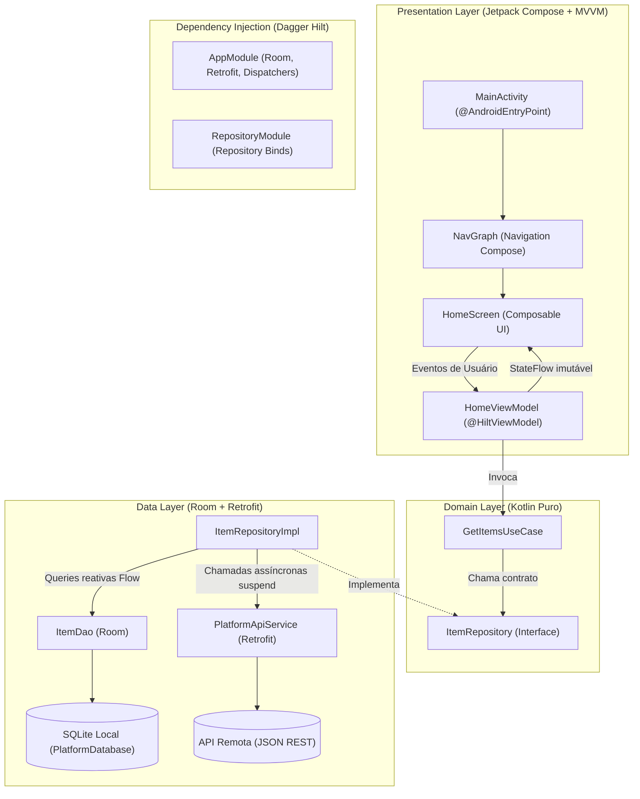

# Arquitetura Técnica do Sistema Android (.ai/ARCHITECTURE.md)

Este documento é a **referência técnica primária e canônica** da arquitetura do aplicativo móvel **Platform**. Ele orienta desenvolvedores e **Agentes de IA** sobre o fluxo de dados, contratos, persistência e injeção de dependências.

---

## 1. Topologia da Aplicação

O aplicativo segue os princípios oficiais da Google de **Modern Android Architecture (MAD)** combinados com **Clean Architecture**:



---

## 2. Stack Tecnológica e Bibliotecas Principais

- **Linguagem**: Kotlin 1.9.23+ com Kotlin DSL no Gradle.
- **UI Toolkit**: Jetpack Compose com Material 3 (`compose-bom:2024.04.00`).
- **Navegação**: Navigation Compose com rotas tipadas em sealed class.
- **Injeção de Dependências**: Dagger Hilt 2.51 com KSP (Kotlin Symbol Processing).
- **Persistência Local**: Room 2.6.1 com suporte nativo a Coroutines e Flow.
- **Comunicação de Rede**: Retrofit 2.10.0 + Gson Converter + OkHttp Logging Interceptor.
- **Concorrência**: Kotlin Coroutines e StateFlow/SharedFlow.
- **Testes Unitários**: JUnit 4, MockK (mocking de coroutines e dispatchers) e Turbine (testes reativos de StateFlow).

---

## 3. Divisão de Camadas e Responsabilidades

```
app/src/main/java/com/platform/app/
├── core/                     # Utilitários globais e abstrações de infraestrutura
│   ├── dispatcher/           # DispatcherProvider para desacoplamento de Dispatchers.IO/Main
│   └── util/                 # Resource<T> (Success, Error, Loading)
├── data/                     # Camada de dados e comunicação externa
│   ├── local/
│   │   ├── dao/              # Interfaces Room @Dao com queries @Query e @Insert
│   │   ├── entity/           # Classes @Entity com mapeamento para modelos de domínio
│   │   └── PlatformDatabase  # Classe abstrata @Database do Room
│   ├── remote/
│   │   ├── dto/              # Data Transfer Objects serializados via Gson
│   │   └── PlatformApiService# Interface Retrofit de endpoints HTTP
│   └── repository/           # Implementações concretas de repositórios
├── domain/                   # Camada de negócio pura (sem código Android)
│   ├── model/                # Data classes puras de negócio
│   ├── repository/           # Interfaces de repositório (inversão de dependência)
│   └── usecase/              # Interactors de responsabilidade única
├── di/                       # Injeção de dependências Hilt
│   ├── AppModule.kt          # Provimento de Room, Retrofit e Dispatchers
│   └── RepositoryModule.kt   # Binds de repositórios para o grafo
└── presentation/             # Camada de interface e interação
    ├── components/           # Componentes Compose reutilizáveis (PlatformAppBar, etc.)
    ├── navigation/           # Screen.kt e NavGraph.kt
    ├── theme/                # Color, Type, Theme com suporte a Dark Mode e Dynamic Color
    └── <feature>/            # Telas modulares (ex: home/ com Screen, ViewModel e UiState)
```

---

## 4. Fluxo Unidirecional de Dados (UDF)

1. A tela Compose observa o `StateFlow` exposto pela ViewModel (`val uiState by viewModel.uiState.collectAsState()`).
2. Qualquer interação do usuário (ex: clique no botão salvar) dispara uma função de intenção na ViewModel (`viewModel.addItem(...)`).
3. A ViewModel executa a operação dentro de `viewModelScope.launch` invocando o UseCase ou Repositório.
4. O repositório salva no Room e sincroniza com a API.
5. O Room emite uma nova lista via `Flow` para o UseCase e ViewModel.
6. A ViewModel atualiza o `uiState` com `_uiState.update { it.copy(...) }`.
7. O Compose recompõe automaticamente apenas os nós afetados na árvore de visualização.
