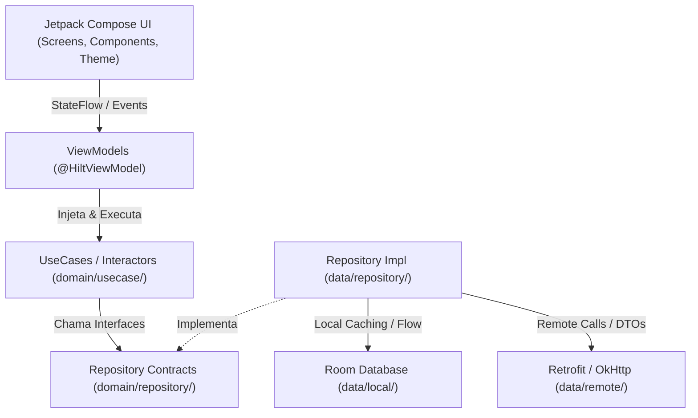

# Diretrizes e Manual Operacional para Agentes de IA (AGENT_RULES.md)

Este documento estabelece as diretrizes mandatórias de desenvolvimento, padrões arquiteturais e governança de contexto para qualquer **Agente de IA** atuando no projeto **Platform (Android App)**.

---

## 1. Visão Geral da Arquitetura (Android Clean Architecture)

O projeto adota Clean Architecture combinada com o padrão MVVM / MVI e componentes reativos do Jetpack Compose:

### 1.1 Divisão Estrita de Camadas
- `app/src/main/java/com/platform/app/presentation/`:
  - Camada de exibição pura e gerenciamento de estado de tela.
  - Composta por **Composables** (`screens/`, `components/`), **ViewModels** (anotados com `@HiltViewModel`), **UiState** imutáveis e temas Material 3 (`theme/`).
  - **Proibido**: Fazer chamadas diretas de banco de dados, APIs ou I/O dentro de Composables ou ViewModels.
- `app/src/main/java/com/platform/app/domain/`:
  - O coração das regras de negócio do aplicativo.
  - Contém **modelos de domínio puros** (`model/`), interfaces de repositórios (`repository/`) e casos de uso de responsabilidade única (`usecase/`).
  - **Proibido**: Dependências de frameworks Android (como Context, Views, Room, Retrofit). Código 100% puro Kotlin.
- `app/src/main/java/com/platform/app/data/`:
  - Implementação concreta de acesso a dados e persistência.
  - Contém **Room DAOs e Entities** (`local/`), clientes HTTP **Retrofit e DTOs** (`remote/`) e implementações de repositórios (`repository/`).
  - Responsável por mapear DTOs e Entities para modelos de domínio (`toDomain()`).
- `app/src/main/java/com/platform/app/di/`:
  - Módulos Dagger Hilt (`@Module`, `@InstallIn(SingletonComponent::class)`) para injeção e provimento de dependências singleton e vinculação de repositórios.
- `app/src/main/java/com/platform/app/core/`:
  - Utilitários globais, despachantes de coroutines (`DispatcherProvider`), extensões e classes seladas de resultado (`Resource<T>`).

---

## 2. Regras Mandatórias de Código

1. **Operação 100% Offline-First**:
   - Todo dado gerado no app deve ser lido e gravado exclusivamente no banco local **Room** e **DataStore**. Nenhuma funcionalidade pode depender de resposta de rede para funcionar. O cliente HTTP e endpoints remotos são desacoplados e reservados para fases futuras.
2. **Padrão MVI com Canal de Efeitos (`UiEffect`)**:
   - A tela emite intenções via `UiAction` (`onAction(action)`).
   - Efeitos transitórios (Snackbars, navegação, diálogos) NUNCA devem residir no `UiState`. Devem trafegar através de um `Channel<UiEffect>(Channel.BUFFERED)` exposto como Flow e consumido na UI via `LaunchedEffect`.
3. **Nunca misture lógica de apresentação com regras de negócio**:
   - Composables devem ser o mais puros e "burros" possível, recebendo estados (`UiState`) e emitindo eventos por lambdas.
4. **Tipagem e Imutabilidade Estrita**:
   - Todo estado de UI deve ser representado por uma `data class` imutável (ex: `HomeUiState`).
   - Proibido o uso de `Any` ou variáveis mutáveis públicas (`var`). Use `MutableStateFlow` privado e exponha `StateFlow` público imutável via `asStateFlow()`.
5. **Assincronismo Seguro com Coroutines e Flow**:
   - Todo acesso a banco e arquivos deve ser executado em background via Coroutines (`viewModelScope.launch`) injetando `DispatcherProvider.io`.
   - Colete fluxos na UI de forma segura com `collectAsState()` ou `collectAsStateWithLifecycle()`.
6. **Material 3 & Dark Mode Obrigatório**:
   - Todas as telas e componentes visuais DEVEM suportar nativamente **Modo Claro** e **Modo Escuro** utilizando as cores semânticas do `MaterialTheme.colorScheme` (ex: `surface`, `background`, `onSurface`, `primary`).
   - Proibido uso de cores hardcoded como `Color.White` ou `Color.Black` diretamente em componentes de UI.
7. **Tratamento de Estados (Carregamento, Vazio e Erro)**:
   - Toda tela que consome dados deve tratar explicitamente os 3 estados: `isLoading` (spinner/skeleton), `isEmpty` (mensagem informativa e botão de ação) e `isError` (banner amigável e botão de retry).
8. **Política de Resíduo Zero em Testes**:
   - Testes unitários e de integração devem rodar isolados com dispatchers de teste (`StandardTestDispatcher`), mocks (MockK/Turbine) ou banco em memória (`Room.inMemoryDatabaseBuilder`).

---

## 3. Instruções para o Agente: Como Adicionar uma Nova Feature

Ao receber uma demanda para implementar uma nova funcionalidade (exemplo: `UserProfile`), siga este fluxo:

### Passo 1: Domínio Puro
1. Defina o modelo em `domain/model/<Feature>.kt`.
2. Adicione os métodos necessários na interface `domain/repository/<Feature>Repository.kt`.
3. Crie os casos de uso em `domain/usecase/Get<Feature>UseCase.kt`.

### Passo 2: Camada de Dados (Room e/ou Retrofit)
1. Crie a entidade Room em `data/local/entity/<Feature>Entity.kt` e o DAO em `data/local/dao/<Feature>Dao.kt`.
2. Se houver API externa, crie o DTO em `data/remote/dto/<Feature>Dto.kt` e declare o endpoint em `PlatformApiService.kt`.
3. Implemente o repositório em `data/repository/<Feature>RepositoryImpl.kt`.

### Passo 3: Injeção de Dependências
1. Adicione o DAO no `PlatformDatabase.kt` e proveja-o no `di/AppModule.kt`.
2. Registre o binding do novo repositório em `di/RepositoryModule.kt`.

### Passo 4: Camada de Apresentação (Compose + ViewModel)
1. Crie o estado imutável em `presentation/<feature>/<Feature>UiState.kt`.
2. Crie a `presentation/<feature>/<Feature>ViewModel.kt` anotada com `@HiltViewModel`.
3. Crie a tela Compose em `presentation/<feature>/<Feature>Screen.kt` com suporte a Light/Dark theme.
4. Adicione a rota em `presentation/navigation/Screen.kt` e registre o composable no `NavGraph.kt`.

### Passo 5: Testes e Validação
1. Crie testes unitários para os casos de uso e ViewModel em `app/src/test/`.
2. Atualize o checklist em `.ai/STATUS.md` e registre novos ADRs em `.ai/DECISIONS/` se houver mudança arquitetural.

---

## 4. Repositório de Skills e Regras (`.agents/`)

- **Skills Disponíveis (`.agents/skills/<skill-name>/SKILL.md`)**:
  - `add-new-screen-or-feature`: Guia passo a passo com modelos para criar telas e fluxos.
  - `android-compose-design-system`: Padrões de interface Material 3, Dark Mode e previews.
  - `android-testing-suite`: Práticas de testes unitários (MockK, Turbine, JUnit) e instrumentação.
  - `gradle-build-and-lint`: Comandos canônicos de compilação, verificação estática e lint.
  - `security-guard`: Diretrizes de DevSecOps, Android Keystore, ProGuard/R8 e `local.properties`.
  - `token-optimizer`: Protocolo para economia cirúrgica de contexto em projetos Android.
- **Regras Mandatórias (`.agents/rules/*.md`)**:
  - `architecture.md`: Fronteiras invioláveis entre Presentation, Domain e Data.
  - `coding_standards.md`: Convenções idiomáticas de Kotlin, imutabilidade e StateFlow.
  - `test_data_cleanup.md`: Política de Resíduo Zero.
